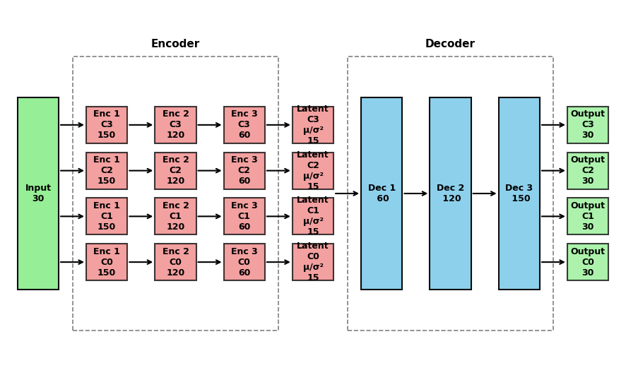

# CISS-VAE

## Python implementation of the Clustering-Informed Shared-Structure Variational Autoencoder (CISS-VAE)

CISS-VAE is a flexible deep learning model for missing data imputation that accommodates all three types of missing data mechanisms: Missing Completely At Random (MCAR), Missing At Random (MAR), and Missing Not At Random (MNAR). While it is particularly well-suited to MNAR scenarios where missingness patterns carry informative signals, CISS-VAE also functions effectively under MAR assumptions.

## Installation

The CISS-VAE package is currently available for python, with an R
package to be released soon. It can be installed from either
[github](https://github.com/CISS-VAE/CISS-VAE-python) or PyPI.

``` bash
# From PyPI
pip install ciss-vae

```
OR

``` bash
# From GitHub (latest development version)
pip install git+https://github.com/CISS-VAE/CISS-VAE-python.git
```

<div>

> **Important!**
>
> If you want run_cissvae to handle clustering, please install the
> clustering dependencies scikit-learn and hdbscan with pip.
>
> ``` bash
> pip install scikit-learn hdbscan
>
> OR
>
> pip install ciss-vae[clustering]
> ```

</div>

## Quickstart Tutorial

The full vignette can be found [here](https://ciss-vae.readthedocs.io/en/latest/vignette.html#).

Your input dataset should be one of the following:

    - A Pandas DataFrame  

    - A NumPy array  

    - A PyTorch tensor  

Missing values should be represented using np.nan or None.

``` python
import pandas as pd
from ciss_vae.utils.run_cissvae import run_cissvae

# optional, display vae architecture
from ciss_vae.utils.helpers import plot_vae_architecture

data = pd.read_csv("/data/test_data.csv")

clusters = data.clusters
data = data.drop(columns = ["clusters", "Unnamed: 0"])

imputed_data, vae = run_cissvae(data = data,
## Dataset params
    val_percent = 0.1, ## Fraction of non-missing data held out for validation
    replacement_value = 0.0, 
    columns_ignore = data.columns[:5], ## Names of columns to ignore when selecting validation dataset (and clustering if you do not provide clusters). For example, demographic columns with no missingness.
    print_dataset = True, 

## Cluster params
    clusters = None, ## Where your cluster list goes. If none, will do clustering for you  
    n_clusters = None, ## If you want run_cissvae to do clustering and you know how many clusters your data should have
    cluster_selection_epsilon = 0.25, ## Cluster Selection Epsilon for HDBSCAN (link)
    seed = 42,

## VAE model params
    hidden_dims = [150, 120, 60], ## Dimensions of hidden layers, in order. One number per layer. 
    latent_dim = 15, ## Dimensions of latent embedding
    layer_order_enc = ["unshared", "unshared", "unshared"], ## order of shared vs unshared layers for encode (can use u or s instead of unshared, shared)
    layer_order_dec=["shared", "shared",  "shared"],  ## order of shared vs unshared layers for decode
    latent_shared=False, 
    output_shared=False, 
    batch_size = 4000, ## batch size for data loader
    return_model = True, ## if true, outputs imputed dataset and model, otherwise just outputs imputed dataset. Set to true to return model for `plot_vae_architecture`

## Initial Training params
    epochs = 1000, ## default 
    initial_lr = 0.01, ## default
    decay_factor = 0.999, ## default, factor learning rate is multiplied by after each epoch, prevents overfitting
    beta= 0.001, ## default
    device = None, ## If none, will use gpu if available, cpu if not. See torch.devices for info (link)

## Impute-refit loop params
    max_loops = 100, ## max number of refit loops
    patience = 2, ## number of loops to check after best_dataset updated. Can increase to avoid local extrema
    epochs_per_loop = None, ## If none, same as epochs
    initial_lr_refit = None, ## If none, picks up from end of initial training
    decay_factor_refit = None, ## If none, same as decay_factor
    beta_refit = None, ## if none, same as beta
    verbose = False
)

## OPTIONAL - PLOT VAE ARCHITECTURE
plot_vae_architecture(model = vae,
                        title = None, ## Set title of plot
                        ## Colors below are default
                        color_shared = "skyblue", 
                        color_unshared ="lightcoral",
                        color_latent = "gold", 
                        color_input = "lightgreen",
                        color_output = "lightgreen",
                        figsize=(16, 8),
                        return_fig = False)
```
